# Projeto de Interface

A interação do usuário é guiada por telas bem estruturadas que priorizam clareza e acessibilidade, utilizando wireframes e protótipos interativos para validação das funcionalidades. A interface reflete a identidade visual definida (paleta de cores, tipografia Inter, e iconografia com Phosphor Icons e Ionicons), com suporte a temas claro e escuro, atendendo a requisitos de usabilidade e estética.

As principais telas incluem:
- **Home/Dashboard:** Exibe um resumo financeiro com saldo atual, total de receitas e despesas, além de gráficos interativos (pizza e linha) para análise visual.
- **Categoria:** Permite editar, remover e adicionar categorias ao sistema de gerenciamento financeiro. 
- **Transações:** Permite adicionar, editar e visualizar transações, com filtros por data e categoria.

## User Flow

O diagrama de User flow abaixo apresenta o caminho percorrido pelo usuário dentro do site. Ele foi desenvolvido para garantir uma navegação simples, intuitiva e centrada na experiência do usuário, refletindo o objetivo do projeto facilitar o controle financeiro.
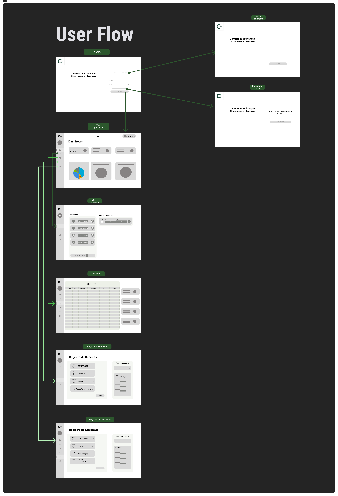

[⬇ User Flow (PDF)](img/UserFlow.pdf)

## Wireframes

### Login
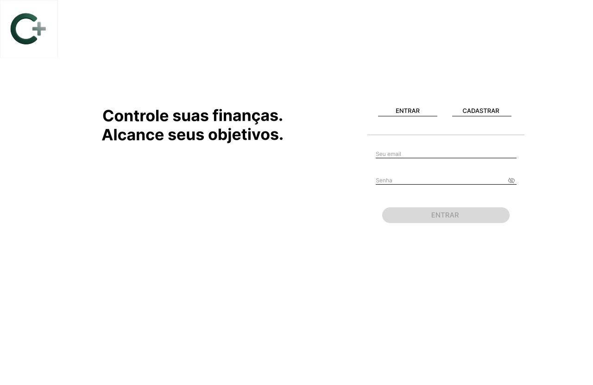
### Cadastro 

### Recuperar Senha 
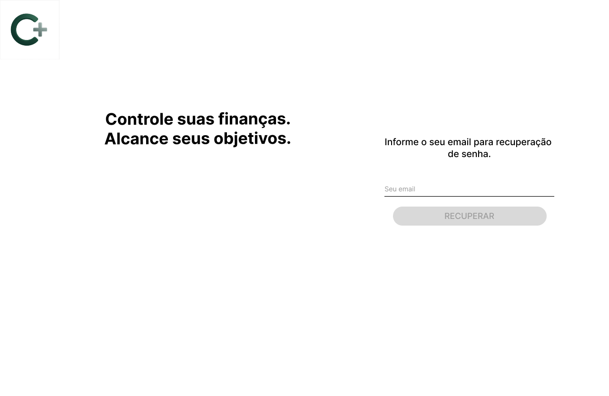.

### Dashboard
No wireframe do dashboard, elaboramos a visão inicial da Home do Controla+, estruturando uma interface que centraliza as informações financeiras mais relevantes para o usuário.
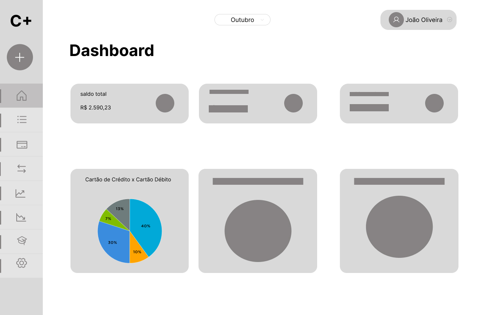
[⬇ Wireframe - Dashboard - 1 (PDF)](/img/wireframe-dashboard-1.pdf)

### Transações
No wireframe de transações construimos uma visão inicial de como o usuário conseguirá visualizar todas as transações financeiras registradas durante o período selecionado.
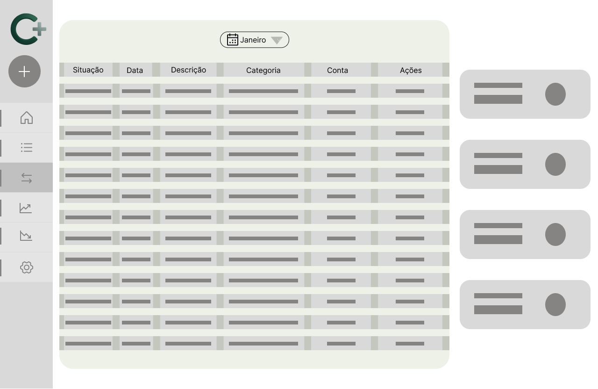

### Categorias
Nesse wireframe podemos ter a visão inicial da tela de inclusão e edição de categorias de transações
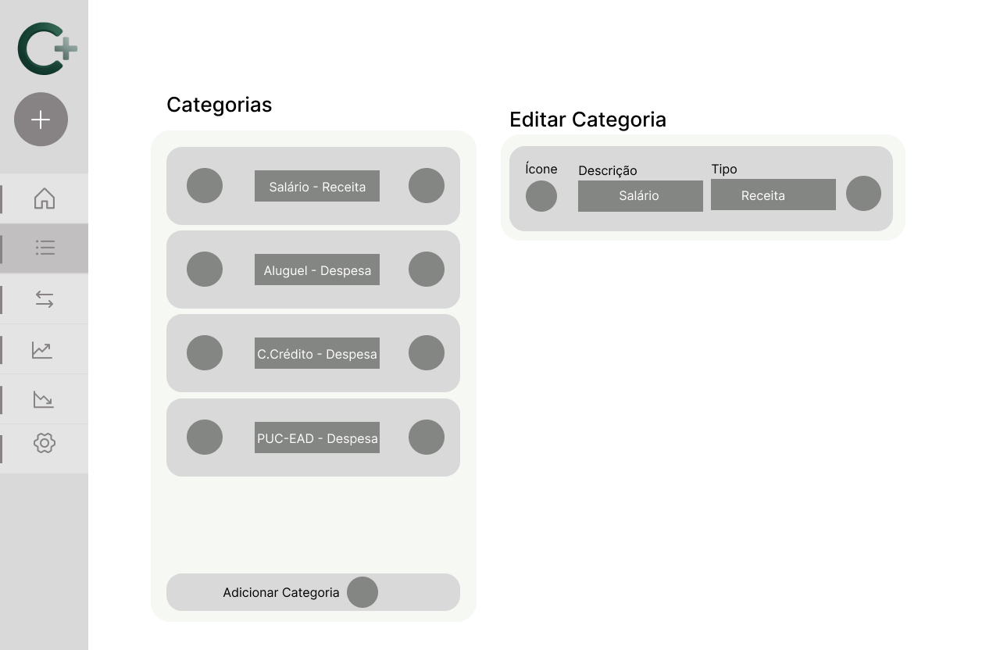.

### Receitas
A tela de receitas apresenta no lado direito registros de receitas, o usuário pode adicionar uma nova receita descrevendo data, valor, categoria e método de recebimento. Ao lado esquerdo o usuario pode visualizar um pequeno histórico com as ultimas receitas adicionadas.
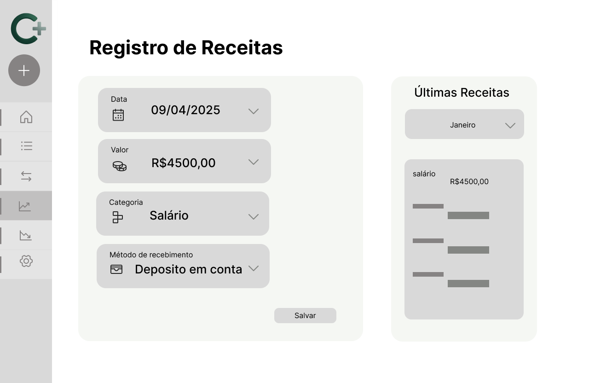

### Despesas
A tela de despesas apresenta no lado direito registros de despesas, o usuário pode adicionar uma nova despesa descrevendo data, valor, categoria e método de pagamento. Ao lado esquerdo o usuario pode visualizar um pequeno histórico com as ultimas despesas adicionadas.
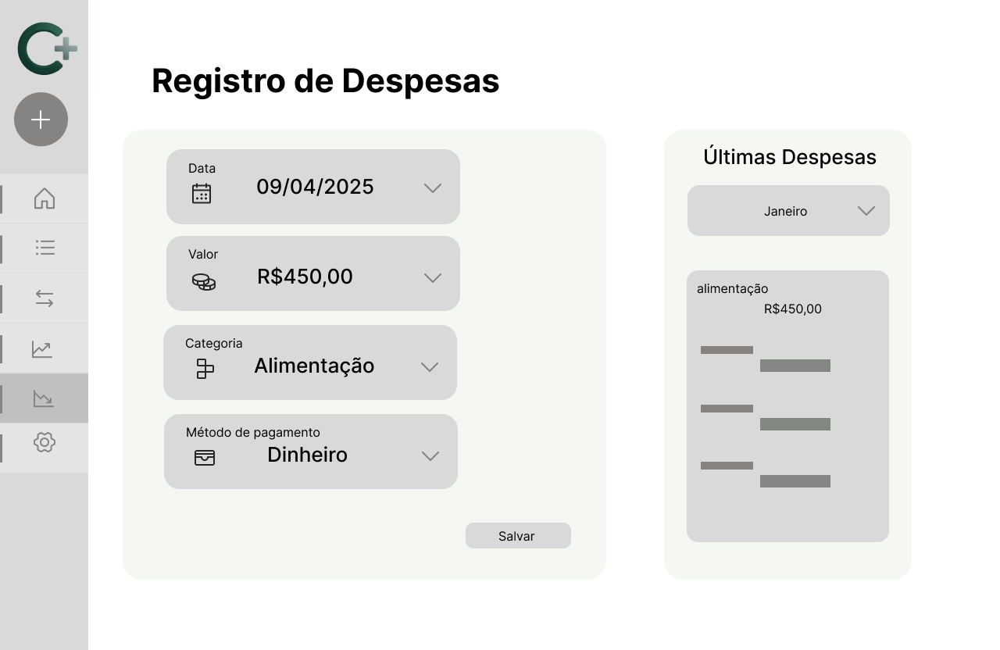

## Protótipos
Esta seção apresenta os protótipos interativos das principais telas do Controla+, destacando a estrutura visual e funcional para validação de usabilidade e requisitos do sistema.

### Dashboard
O protótipo do Dashboard exibe a Home do Controla+, com cards de "Saldo Atual" (R$ 1.400,00), "Receitas" (R$ 4.500,00) e "Despesas" (R$ 3.100,00) no topo, usando fundo #191d17 e texto #e0e4db. 
Inclui gráficos interativos: um de pizza (65% crédito, 35% débito) e outro de linha para evolução de receitas/despesas, com filtros (Diário, Semanal, Mensal). A sidebar à esquerda tem ícones para navegação, e o logo "C+" está no topo, com dropdown de perfil à direita.
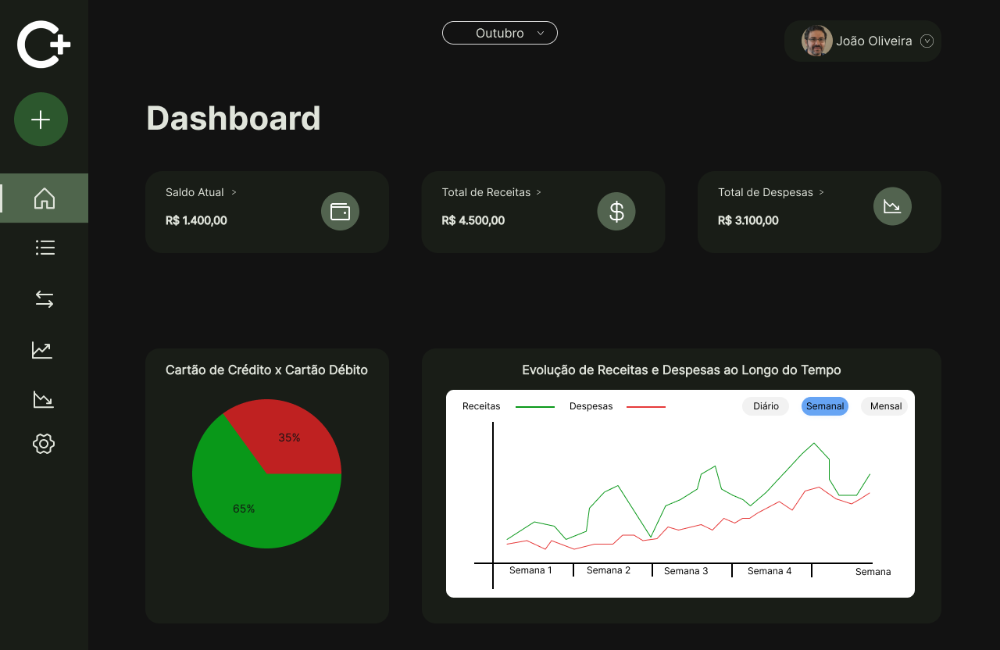

[⬇ User Flow (PDF)](img/prototipo-dashboard.pdf)

### Receitas

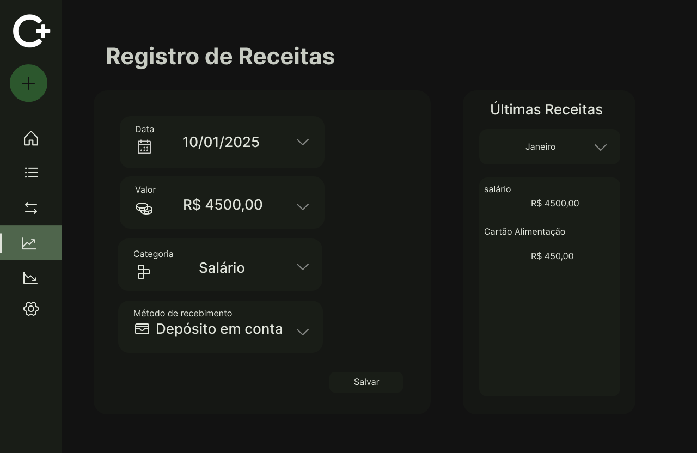

### Despesas

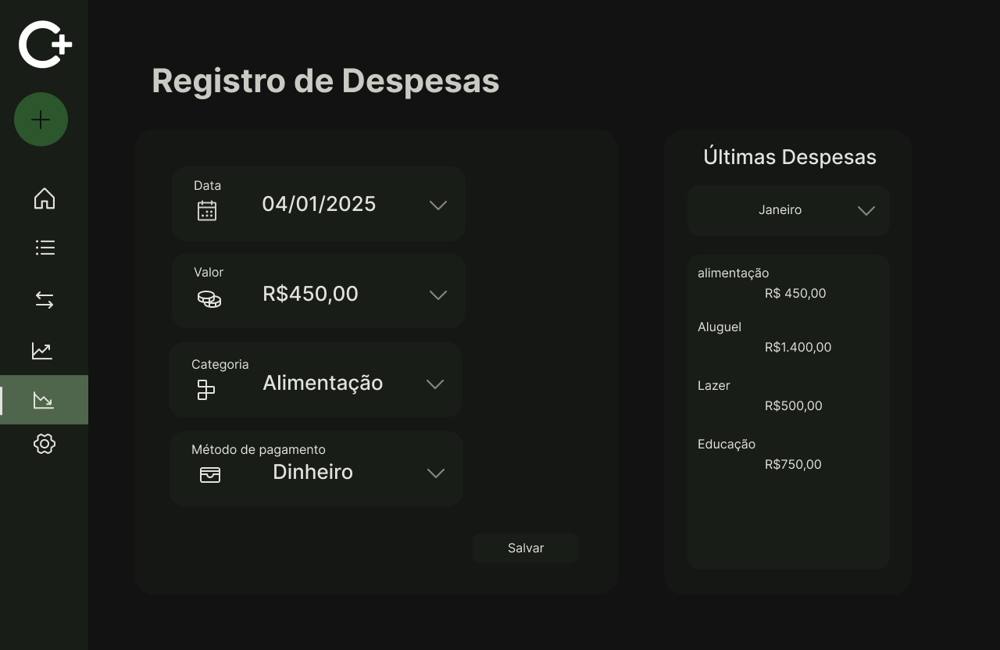

