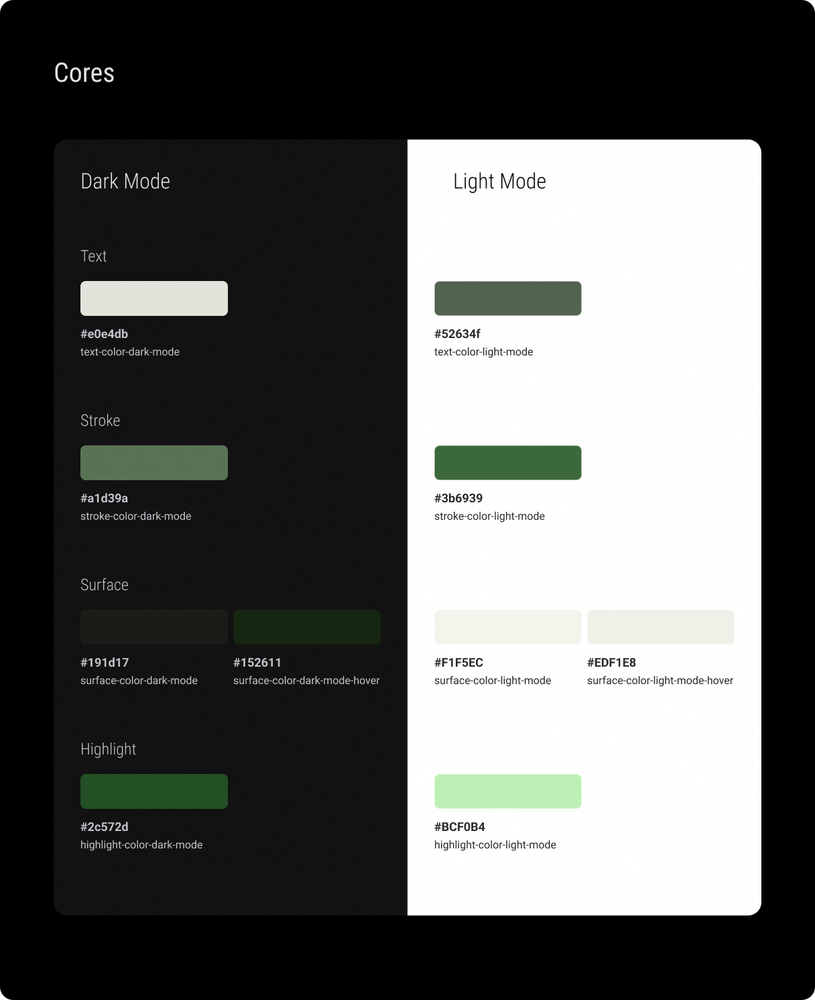
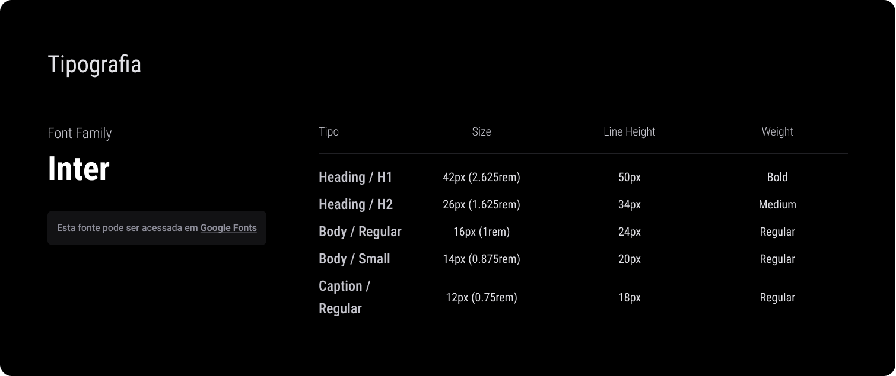
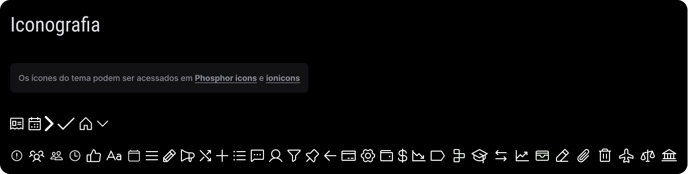

# Template padrão do site

## Design do Controla+

O design do Controla+ é estruturado para oferecer uma experiência intuitiva e consistente, com layouts que priorizam usabilidade e identidade visual em um contexto financeiro. Abaixo estão os detalhes:

- **Layouts Utilizados:** O site segue um layout de página única com seções bem definidas: **header**, **main** e **footer**. O header é fixo no topo para navegação constante, o main é flexível para diferentes tipos de conteúdo (ex.: dashboards, formulários), e o footer é minimalista com informações de rodapé. Páginas específicas como "Transações" e "Relatórios" usam um layout de grid com sidebar à esquerda (em telas grandes) para filtros e opções, enquanto o conteúdo principal ocupa a maior parte da tela.
  
- **Posição do Logo:** O logo do Controla+ é posicionado no canto superior esquerdo do header, com 150px de largura (ajustado para 120px em telas menores que 768px). Ele serve como link para a página inicial, garantindo fácil acesso à Home.

- **Menus Padrão:** O menu principal está no header, à direita do logo, com links para "Home", "Transações", "Relatórios" e "Configurações". Cada item do menu é acompanhado por um ícone (ex.: casa para "Home", cifrão para "Transações") da biblioteca Phosphor Icons. Em dispositivos móveis, o menu colapsa em um ícone de hambúrguer, que ao clicado exibe um dropdown vertical. Páginas com sidebar (ex.: "Relatórios") têm um menu secundário à esquerda com opções como "Filtrar por Data" e "Exportar".

- **Outros Elementos de Design:** 
  - **Botões e Ações:** Botões principais (ex.: "Adicionar Transação") usam o highlight da paleta (#bcf0b4 no modo claro, #2e572d no escuro) com hover (#edf1e8/#152611), garantindo contraste e interatividade.
  - **Tipografia:** Títulos de página (H1, 42px, Bold) são centralizados no topo do main, enquanto seções (H2, 26px, Medium) têm margem inferior de 16px para separação visual.
  - **Responsividade:** Em telas menores que 768px, a sidebar colapsa em um menu expansível, e o grid do main ajusta-se para uma coluna única, mantendo a legibilidade.

O design é funcional e focado no usuário, com uma estética limpa que reforça a confiabilidade necessária para um sistema financeiro.

## Paleta de Cores do Controla+
A paleta de cores do Controla+ foi projetada para transmitir confiabilidade e clareza em um site de controle financeiro, com modos claro e escuro para acessibilidade.  

### Modo Escuro
- **Texto (#e0e4db):** Alto contraste contra o fundo (#191d17), reduzindo fadiga visual.  
- **Hover (#152611):** Sutil para interatividade.  
- **Stroke (#a1d39a) e Highlight (#2e572d):** Tons de verde que evocam estabilidade e crescimento, reforçando a identidade financeira.  

### Modo Claro
- **Texto (#52634f):** Suave contra o fundo (#f1f5ec), priorizando legibilidade.  
- **Hover (#edf1e8):** Transições delicadas.  
- **Stroke (#3b6929) e Highlight (#bcf0b4):** Consistência tonal, promovendo confiança e foco.  

Cada cor equilibra estética e funcionalidade, alinhando-se à usabilidade e ao contexto financeiro.

[⬇ Paleta de Cores (PDF)](https://github.com/ICEI-PUC-Minas-PMV-SI/pmv-si-2025-1-pe1-t7-controla/blob/main/docs/img/paleta-de-cores.pdf)

## Tipografia do Controla+

A tipografia do Controla+ utiliza a fonte **Inter**, acessada via Google Fonts, para garantir consistência e legibilidade em um site de controle financeiro.  

- **Título de Página (Heading / H1):** 42px (2.625rem), line-height 50px, peso Bold, para destacar e estruturar páginas com clareza.  
- **Título de Seção (Heading / H2):** 26px (1.625rem), line-height 34px, peso Medium, para organizar seções de forma hierárquica.  
- **Rótulos de Componentes (Body / Regular):** 16px (1rem), line-height 24px, peso Regular, para clareza em labels e botões.  
- **Corpo de Texto (Body / Small):** 14px (0.875rem), line-height 20px, peso Regular, para textos longos com conforto visual.  

A escolha da Inter assegura uma estética moderna e funcional, otimizada para finanças.

[⬇ Tipografia (PDF)](https://github.com/ICEI-PUC-Minas-PMV-SI/pmv-si-2025-1-pe1-t7-controla/blob/main/docs/img/tipografia.pdf)

### Iconografia do Controla+

A iconografia do Controla+ prioriza clareza e usabilidade em um site de controle financeiro, utilizando ícones das bibliotecas livres **Phosphor Icons** e **Ionicons** para evitar violação de direitos autorais.  

- **Seleção de Ícones:** Inclui símbolos intuitivos como casa (Home), calendário, gráficos e cifrão, alinhados às funções financeiras, garantindo reconhecimento imediato.  
- **Estilo Visual:** Ícones vetoriais com traços limpos e consistentes, otimizados para os modos claro e escuro da paleta, mantendo legibilidade.  
- **Licenciamento Seguro:** Uso exclusivo de bibliotecas open-source, respeitando licenças e promovendo conformidade legal.  

A escolha reflete um design funcional e ético, focado na experiência do usuário.

[⬇ Iconografia (PDF)](https://github.com/ICEI-PUC-Minas-PMV-SI/pmv-si-2025-1-pe1-t7-controla/blob/main/docs/img/Iconografia.pdf)
